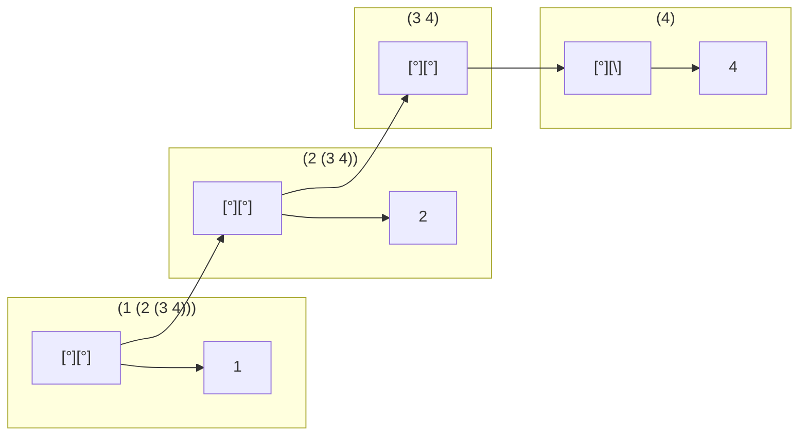

## 2.17
````scheme
; 2.17

; Define a procedure last-pair that returns the list that contains only the last element of a given (nonempty) list:

(define (list-ref items n)
  (if (= n 0)
      (car items)
      (list-ref (cdr items) (- n 1))))


(define (last-pair l)
  (list-ref l ( - (length l) 1))
  )
````

## 2.18
````scheme
; Define a procedure reverse that takes a list as argument and returns a list of the same elements in reverse order:

(define (reverse l)
    (define (rev newList n)
      (if (= (length l) n)
          newList
        (rev  (cons (list-ref l n) newList) (+ n 1)))
  )
  (rev (list) 0)
  )
````
## 2.19
````scheme
(define us-coins (list 50 25 10 5 1))
(define uk-coins (list 100 50 20 10 5 2 1 0.5))
(define reversed-coins (list 1 5 10 25 50))

; Define the procedures first-denomination, except-first-denomination, and no-more? in terms of primitive operations on list structures.


(define (no-more? coin-values)
  (= (length coin-values) 0)
  )

(define (first-denomination coin-values)
  (car coin-values)
  )

(define (except-first-denomination coin-values)
  (cdr coin-values)
  )


(define (cc amount coin-values)
  (cond ((= amount 0) 1)
        ((or (< amount 0) (no-more? coin-values)) 0)
        (else
         (+ (cc amount
                (except-first-denomination coin-values))
            (cc (- amount
                   (first-denomination coin-values))
                coin-values)))))


;(cc 100 us-coins)

; Does the order of the list coin-values affect the answer produced by cc? Why or why not?
;(cc 100 reversed-coins)

; It doesn't seem like the order actually matters in this scenario. We are always subtracting and computing every possible combination
````
## 2.20
````scheme
(define (same-parity . l)
  (define (even? x)
    (= (remainder x 2) 0))
  (define (parity newList listElement even)

      (if (= (length l) listElement)
          newList
          (if (or (and (even? (list-ref l listElement)) even)  (and (not (even? (list-ref l listElement))) (not even)))
           (parity  (cons (list-ref l listElement) newList ) (inc listElement) even)
           (parity  newList (inc listElement) even)
           )
          )
  )
  (reverse (parity (list) 0 (even? (car l)))
          )
  )

; I don't love this solution with the reverse - it can also be done with a counter - but that seems to run counter to lisp elegance 

(define (same-parity2 . l)
  (define (even? x)
    (= (remainder x 2) 0))
  (define (parity newList listRemainder even)

      (if (= (length listRemainder) 0)
          newList
          (if (or (and (even? (car listRemainder)) even)  (and (not (even? (car listRemainder))) (not even)))
           (parity  (cons (car listRemainder) newList ) (cdr listRemainder) even)
           (parity  newList (cdr listRemainder) even)
           )
          )
  )
  (reverse (parity (list) l (even? (car l)))
          )
  )


;(same-parity 1 2 3 4 5 6 7)
;(1 3 5 7)

;(same-parity 2 3 4 5 6 7)
;(2 4 6)

;(same-parity2 1 2 3 4 5 6 7)
;(1 3 5 7)

;(same-parity2 2 3 4 5 6 7)
;(2 4 6)
````
## 2.21
````scheme
;2.21

(define (scale-list items factor)
  (if (null? items)
      nil
      (cons (* (car items) factor)
            (scale-list (cdr items) factor))))

(define (map proc items)
  (if (null? items)
      nil
      (cons (proc (car items))
            (map proc (cdr items)))))


;Here are two different definitions of square-list. Complete both of them by filling in the missing expressions:

(define (square-list items)
  (if (null? items)
      nil
      (cons (* (car items) (car items)) (square-list (cdr items)))))
(define (square-list2 items)
  (map (lambda (x) (* x x)) items))

(square-list (list 1 2 3 4))
````
## 2.22
````scheme
; 2.22

; Louis Reasoner tries to rewrite the first square-list procedure of exercise 2.21 so that it evolves an iterative process:

(define (square-list3 items)
  (define (iter things answer)
    (if (null? things)
        answer
        (iter (cdr things) 
              (cons (square (car things))
                    answer))))
  (iter items nil))


; Unfortunately, defining square-list this way produces the answer list in the reverse order of the one desired. Why?
; This is reversed because when you iterate through the list it builds the list - and building a list with cons (newElement existingList) always builds the list backwards.
; In other words if you iterate through (list 1 2 3) and call (cons 1 newList) (cons 2 newList) (cons 3 newList) you get (list 3 2 1)

;Louis then tries to fix his bug by interchanging the arguments to cons:

(define (square-list4 items)
  (define (iter things answer)
    (if (null? things)
        answer
        (iter (cdr things)
              (cons answer
                    (square (car things))))))
  (iter items nil))

;This doesn't work either. Explain.
;(square-list4 (list 1 2 3 4))
; reversing the arguments to cons won't work either. In that case you get a malformed list with nulls as the first argument
````

## 2.23
````scheme
; Give an implementation of for-each.


(define (for-each proc items)
  (cond ((> (length items) 0) (proc (car items))
       (for-each proc (cdr items)))
      )
  )

;(for-each (lambda (x) (newline) (display x))
 ;         (list 57 321 88))
````
## 2.24

 Suppose we evaluate the expression (list 1 (list 2 (list 3 4))).
 Give the result printed by the interpreter

````scheme
(1 ( 2 ( 3 4)))
````

 the corresponding box-and-pointer structure,




 and the interpretation of this as a tree (as in figure 2.6).
````mermaid
graph TD
    A(("(1 (2 (3 4)))"))-->B((1))
    A-->C(("(2 ( 3 4))"))
    C-->F((2))
    C-->G(("(3 4)"))
    G-->E(("3"))
    G-->H(("4"))
````
 ## 2.25
````scheme
; Give combinations of cars and cdrs that will pick 7 from each of the following lists:

;(1 3 (5 7) 9)
;cdr cdr car cdr


;((7))
; car car

;(1 (2 (3 (4 (5 (6 7))))))
; cdr cdr cdr cdr cdr
````

## 2.26
````scheme
(define x (list 1 2 3))
(define y (list 4 5 6))

;(append x y)
; (1 2 3 4 5 6)
;(cons x y)
; ((1 2 3) 4 5 6)
;(list x y)
; ((1 2 3) (4 5 6))
````
 ## 2.27
 ````scheme
(define (deep-reverse l)

  (rev l (list) 0)
  )

    (define (rev oList newList n)
      (if (= (length oList) n)
          newList
          (if (pair? (list-ref oList n))
             (rev oList (cons (rev (list-ref oList n) (list) 0) newList) (+ n 1))
             (rev oList (cons (list-ref oList n) newList) (+ n 1))
             )
          )
  )

(define testList (list (list 1 2) (list 3 4)))
;(reverse testList)
;(deep-reverse testList)
````

## 2.28
````scheme
; Write a procedure fringe that takes as argument a tree (represented as a list) and returns a list whose elements are all the leaves of the tree arranged in left-to-right order. For example,

  
  

(define (fringe tree)
  (findFringes tree (list) 0)
  )

(define (findFringes tree fringes n)
   (cond ((= (length tree) 0) fringes)
       ((pair? (car tree))
           (findFringes (cdr tree) (append fringes (findFringes (car tree) (list) 0) )  (+ n 1)))
       ((not (pair? (car tree)))
           (findFringes (cdr tree) (append fringes (list (car tree)) ) (+ n 1))
           )
       )
  )
  
  


  
;(define xlist (list (list 1 2) (list 3 4)))
;(display xlist)
;(fringe xlist)


;(fringe (list xlist xlist))
````

## 2.29
````scheme
;  A binary mobile consists of two branches, a left branch and a right branch. Each branch is a rod of a certain length, from which hangs either a weight or another binary mobile.
;  We can represent a binary mobile using compound data by constructing it from two branches (for example, using list):
 (define (make-mobile left right)
  (list left right))

; A branch is constructed from a length (which must be a number) together with a structure, which may be either a number (representing a simple weight) or another mobile:
(define (make-branch length structure)
  (list length structure))

;a.  Write the corresponding selectors left-branch and right-branch, which return the branches of a mobile, and branch-length and branch-structure, which return the components of a branch.

(define (left-branch mobile)
  (list-ref mobile 0)
  )

(define (right-branch mobile)
   (list-ref mobile 1)
  )

(define (branch-length branch)
  (list-ref branch 0)
  )

(define (branch-structure branch)
  (list-ref branch 1)
  )

; b.  Using your selectors, define a procedure total-weight that returns the total weight of a mobile.

(define (total-weight mobile)
 (+ (compute-weight (left-branch mobile) 0) (compute-weight (right-branch mobile) 0))
  )

(define (compute-weight branch sum)
   (cond ((pair? (branch-structure branch))
            (+ sum (compute-weight (right-branch (branch-structure branch)) sum) (compute-weight (left-branch (branch-structure branch)) sum)  ) )
       ((not (pair? (branch-structure branch)))
           (+ sum (branch-structure branch))
           )
       )
  )
;(make-branch 1 2)
;  (display "should be 2=")
; (branch-structure (make-branch 1 2))

;(make-branch 2 (make-mobile (make-branch 1 2) (make-branch 3 4)))
;(display "should be 1234=")
;(branch-structure (make-branch 2 (make-mobile (make-branch 1 2) (make-branch 3 4))))

;(display "should be 1 2=")
;(left-branch (make-mobile (make-branch 1 2) (make-branch 2 3)))

;(display "should be 2 3=")
;(right-branch (make-mobile (make-branch 1 2) (make-branch 2 3)))


;(total-weight )
;(total-weight (make-mobile (make-branch 1 2) (make-branch 2 3)))
; 5


;c. A mobile is said to be balanced if the torque applied by its top-left branch is equal to that applied by its top-right branch
; (that is, if the length of the left rod multiplied by the weight hanging from that rod is equal to the corresponding product for the right side) and if each of the submobiles hanging off its branches is balanced.
; Design a predicate that tests whether a binary mobile is balanced.


(define (get-weight state)
  (list-ref state 0)
  )

(define (get-balanced state)
  (list-ref state 1)
  )

(define (is-balanced? mobile)
  (and (get-balanced (balance-test (left-branch mobile) (list 0 #t)))
       
       (get-balanced (balance-test (right-branch mobile) (list 0 #t))) 

       (=
            (* (branch-length (left-branch mobile))
               (get-weight (balance-test (left-branch mobile) (list 0 #t))))
            
            (* (branch-length (right-branch mobile))
               (get-weight (balance-test (right-branch mobile) (list 0 #t))))
            )
  )
  )
  


(define (balance-test branch state)
     (cond ((not (get-balanced state))
            (state))
           ((pair? (branch-structure branch)) 
            (list (+ (get-weight (balance-test (right-branch (branch-structure branch)) state ))
                     (get-weight (balance-test (left-branch (branch-structure branch)) state )))
                  (=  (* (branch-length branch) (get-weight (balance-test (right-branch (branch-structure branch)) state )))
                      (* (branch-length branch) (get-weight (balance-test (left-branch (branch-structure branch)) state )))
                      )
            ))
       ((not (pair? (branch-structure branch)))
           (list (branch-structure branch)  #t)
           )
           )
       )


;d  Suppose we change the representation of mobiles so that the constructors are
; (define (make-mobile left right)
;  (cons left right))
;(define (make-branch length structure)
;  (cons length structure))

; How much do you need to change your programs to convert to the new representation?

; Very little - all I need to do is to change the selectors to be 
(define (left-branch mobile)
  (car mobile )
  )

(define (right-branch mobile)
   (cdr mobile)
  )

(define (branch-length branch)
  (car branch )
  )

(define (branch-structure branch)
  (cdr branch )
  )


````
## 2.30
````scheme
; Define a procedure square-tree analogous to the square-list procedure of exercise 2.21.
; Define square-tree both directly (i.e., without using any higher-order procedures) and

(define (square-tree tree)
  (cond ((null? tree) nil)
        ((not (pair? tree)) (* tree tree))
        (else (cons (square-tree (car tree) )
                    (square-tree (cdr tree) )))))

; also by using map and recursion

(define (square-tree2 tree)
  (map (lambda (sub-tree)
         (if (pair? sub-tree)
             (square-tree2 sub-tree)
             (* sub-tree sub-tree)))
       tree))
````
## 2.31
````scheme
; Abstract your answer to exercise 2.30 to produce a procedure tree-map with the property that square-tree could be defined as

(define (tree-map func tree)
  (map (lambda (sub-tree)
         (if (pair? sub-tree)
             (square-tree2 sub-tree)
             (func sub-tree)))
       tree))

(define (square-tree3 tree) (tree-map square tree))
````
## 2.32
````scheme
;  We can represent a set as a list of distinct elements, and we can represent the set of all subsets of the set as a list of lists.
; For example, if the set is (1 2 3), then the set of all subsets is (() (3) (2) (2 3) (1) (1 3) (1 2) (1 2 3)).
; Complete the following definition of a procedure that generates the set of subsets of a set and give a clear explanation of why it works:


(define (subsets s)
  (if (null? s)
      (list nil)
      (let ((rest (subsets (cdr s))))
        (append rest (map (lambda (x) (append (list (car s)) x))      
                          rest)))))

; We append the rest of s (everything but the first element) to a function that maps over appending that first element to the rest of the  list
  
;(subsets  (list 1 2 3) )
;(subsets  (list 1 2 ) )
````

## 2.33
````scheme
; Fill in the missing expressions to complete the following definitions of some basic list-manipulation operations as accumulations:
(define (accumulate2 op initial sequence)
  (if (null? sequence)
      initial
      (op (car sequence)
          (accumulate2 op initial (cdr sequence)))))

;(accumulate2 + 0 (list 1 2 3 4 5))

(define (map2 p sequence)
  (accumulate2 (lambda (x y) (cons (p x) y)) nil sequence))

;(map2 (lambda (x) (+ 1 x)) (list 1 2 3))

(define (append2 seq1 seq2)
  (accumulate2 cons seq2 seq1))

;(append2 (list 4 5 6) (list 1 2 3))

(define (length2 sequence)
  (accumulate2 (lambda (x y) (+ 1 y)) 0 sequence))

;(length2 (list 1 2 3 4))
````
 ## 2.34
````scheme
(define (horner-eval x coefficient-sequence)
  (accumulate2 (lambda (this-coeff higher-terms)

                 (+ this-coeff (* x higher-terms))
                 )
              0
              coefficient-sequence))

;(horner-eval 2 (list 1 3 0 5 0 1))
````
## 2.35
````scheme
;  Redefine count-leaves from section 2.2.2 as an accumulation:

(define (count-leaves x)
  (cond ((null? x) 0)  
        ((not (pair? x)) 1)
        (else (+ (count-leaves (car x))
                 (count-leaves (cdr x))))))
; (define (accumulate op initial sequence)

(define (count-leaves2 t)
  (accumulate + t (map (lambda (x y) (+ 1 y ) ) t)))
````
## 2.36
````scheme
;The procedure accumulate-n is similar to accumulate except that it takes as its third argument a sequence of sequences, which are all assumed to have the same number of elements.
; It applies the designated accumulation procedure to combine all the first elements of the sequences, all the second elements of the sequences, and so on, and returns a sequence of the results.
; For instance, if s is a sequence containing four sequences, ((1 2 3) (4 5 6) (7 8 9) (10 11 12)), then the value of (accumulate-n + 0 s) should be the sequence (22 26 30).
; Fill in the missing expressions in the following definition of accumulate-n:

(define (accumulate-n op init seqs)
  (if (null? (car seqs))
      nil
      (cons (accumulate2 op init (map car seqs))
            (accumulate-n op init (map cdr seqs)))))
````
## 2.37
````scheme
; Fill in the missing expressions in the following procedures for computing the other matrix operations. (The procedure accumulate-n is defined in exercise 2.36.)

(define (dot-product v w)
  (accumulate2 + 0 (map * v w)))

(define (matrix-*-vector m v)
  (map  (lambda (row)
          (dot-product row v)
          )   m))

;(matrix-*-vector (list ( list 3 4) (list 5 6)) (list 2 3))


(define (transpose mat)
  (accumulate-n cons nil  mat))

;(transpose  (list ( list 3 4) (list 5 6)))


(define (matrix-*-matrix m n)
  (let ((cols (transpose n)))
    (map (lambda (row)
           (matrix-*-vector cols row)
           )
           m
         )
    )
  )
````
 ## 2.38
 ````scheme
; The accumulate procedure is also known as fold-right, because it combines the first element of the sequence with the result of combining all the elements to the right.
; There is also a fold-left, which is similar to fold-right, except that it combines elements working in the opposite direction:

(define (fold-left op initial sequence)
  (define (iter result rest)
    (if (null? rest)
        result
        (iter (op result (car rest))
              (cdr rest))))
  (iter initial sequence))

;(accumulate2 / 1 (list 1 2 3))
; 1.5
;(fold-left / 1 (list 1 2 3))
; 1/6
;(accumulate2 list nil (list 1 2 3))
; (1(2(3())))
;(fold-left list nil (list 1 2 3))
; (((() 1) 2) 3)
;(accumulate2 + 1 (list 1 2 3))
; 7 
;(fold-left + 1 (list 1 2 3))
; 7

; The op must be commutative in order for fold left and fold right to be the same
````
 ## 2.39
````scheme
(define (reverse2 sequence)
  (accumulate2 (lambda (x y)
                 (if (not (null? y))
                     (fringe (list y x))
                     (list x))
                     )
                  nil sequence)
  )

;(reverse2 (list 4 5 6))

(define (reverse3 sequence)
  (fold-left (lambda (x y) (cons y x)) nil sequence))

  ;(reverse3 (list 4 5 6))
````
 ## 2.40
````scheme
;  Define a procedure unique-pairs that, given an integer n,
; generates the sequence of pairs (i,j) with 1< j< i< n.

(define (unique-pairs n)
  (accumulate2 append
            nil
            (map (lambda (i)
                   (map (lambda (j) (list i j))
                        (enumerate-interval 1 (- i 1))))
                 (enumerate-interval 1 n)))
  )

;(unique-pairs 10)

; Use unique-pairs to simplify the definition of prime-sum-pairs given above.


(define (prime-sum-pairs2 n)
  (map make-pair-sum
       (filter prime-sum?
               (unique-pairs n))))

;(prime-sum-pairs 6)
;(prime-sum-pairs2 6)
````

 ## 2.41
````scheme
; Write a procedure to find all ordered triples of distinct positive integers i, j, and k less than or equal to a given integer n that sum to a given integer s.


(define (val-sum-triple? triple value)
  (= value (+ (car triple) (cadr triple) (cadr (cdr triple))))
  )

(define (make-triple-sum triple)
  (list (car triple) (cadr triple) (cadr (cdr triple)) (+ (car triple) (cadr (cdr triple)) (cadr triple)))
  )


(define (unique-triples n)
 (flatmap
   (lambda (k)
         (map (lambda (l) (append k (list l))) (enumerate-interval 1 (- (cadr k) 1))))
                
  (accumulate2 append
            nil
            (map (lambda (i)
                   (map (lambda (j) (list i j))
                        (enumerate-interval 2 (- i 1))))
                 (enumerate-interval 3 n)))
  )
  )
  


(define (equal-sum-triples n s)
  (map make-triple-sum
       (filter (lambda (x)
                 (val-sum-triple? x s))
               (unique-triples n))))
````
## 2.42

This one was really a bear. I'm not particularly happy with my answer but it does work. I've had to evaluate the logic and compare against some other answers i've found on the 'net just to confirm I did the logic correctly. 

````scheme
; ## 2.42

(define empty-board (list))


(define (adjoin-position row col existing-pos)
  (append existing-pos (list (list row col)))
)


(define (queens board-size)
  (define (queen-cols k)
    (display k)
    (newline)
    (if (= k 0)
        (list empty-board)
        (filter
         (lambda (positions) (safe? k positions))
         (flatmap
          (lambda (rest-of-queens)
            (map (lambda (new-row)
                   (adjoin-position new-row k rest-of-queens))
                 (enumerate-interval 1 board-size)))
          (queen-cols (- k 1))))))
  (queen-cols board-size))


(define (in-list? row col l)
  (cond ( (< (length l) 1)
        #f)
        ( (and (= row (car (car l))) (= col (list-ref (car l) 1)))
          #t)
        (else
         (in-list? row col (cdr l))
         )
  )
  )

(define (create-diag-one row col  positions )
  (if (or (= col 0) (= 0 row))
         (if ( > (length positions) 1)
             (cdr positions)
             nil)
        (create-diag-one (- row 1) (- col 1) (append positions (list (list row col))))
        )
  )
         
(define (create-diag-two row col  positions max )
  (if (or (= col max) (= 0 row))
         (if ( > (length positions) 1)
             (cdr positions)
             nil)
        (create-diag-two (- row 1) (+ col 1) (append positions (list (list row col))) max)
        )
  )
(define (create-diag-three row col  positions max )
  (if (or (= col 0) (= max row))
         (if ( > (length positions) 1)
             (cdr positions)
             nil)
        (create-diag-three (+ row 1) (- col 1) (append positions (list (list row col))) max)
        )
  )
(define (create-diag-four row col  positions max )
  (if (or (= col max) (= max row))
         (if ( > (length positions) 1)
             (cdr positions)
             nil)
        (create-diag-four (+ row 1) (+ col 1) (append positions (list (list row col))) max)
        )
  )


  ; get the queen col, row
  (define (get-queen col pos)
    (cond ((= col (list-ref (car pos) 1))
           (car pos))
          (else
           (get-queen col (cdr pos))
           )
          )
    )
    ; find if there is a queen in this col
  (define (find-matching-col col pos)
    (cond
          ((< (length pos) 1)
           #f)
          ((= col (list-ref (car pos) 1))
           #t)
          (else
            (find-matching-col col (cdr pos))))
    )
    (define (find-matching-row row pos)
    (cond ((< (length pos) 1)
           #f)
          ((= row (car (car pos)))
           #t)
          (else
            (find-matching-row row (cdr pos))))
    )
  ; get max dimension of the board (ie the size in one direction)
  (define (get-max-dim existing-pos existing-max)
    (if (< (length existing-pos)  1)
        (+ 1 existing-max)
        (get-max-dim (cdr existing-pos) (if (> (max (car (car existing-pos)) (list-ref (car existing-pos) 1)) existing-max)
                                            (max (car (car existing-pos)) (list-ref (car existing-pos) 1))
                                            existing-max))
        )
    )
    
     ; check if the points are on the line
    (define (find-matching-diag queen pos max-dim) ; there are 4 directions to check
      (let ((row (car queen)) (col (list-ref queen 1)))
      (cond (( > (length (filter (lambda (this-queen) (in-list? (car this-queen) (list-ref this-queen 1) (create-diag-one row col (list)))) pos) ) 0)
           #t)
          ((> (length (filter (lambda (this-queen) (in-list? (car this-queen) (list-ref this-queen 1) (create-diag-two row col (list) max-dim))) pos)) 0)
           #t)
          ((> (length (filter (lambda (this-queen) (in-list? (car this-queen) (list-ref this-queen 1) (create-diag-three row col (list) max-dim))) pos)) 0)
           #t)
          ((> (length (filter (lambda (this-queen) (in-list? (car this-queen) (list-ref this-queen 1) (create-diag-four row col (list) max-dim))) pos)) 0)
           #t)
          (else
              #f)
      
    )
      )
      )

(define (remove-queen item sequence)
  (filter (lambda (x) (not (and (= (list-ref x 1) (list-ref item 1)) (= (list-ref x 0) (list-ref item 0)))))
          sequence))

(define (safe? col existing-pos)
  (let ((queen (get-queen col existing-pos)) (max-dim (get-max-dim existing-pos 0)) (rest-queens (remove-queen (get-queen col existing-pos) existing-pos)))
    (cond ((find-matching-col col rest-queens)
           #f)
          ((find-matching-row (car queen) rest-queens)
           #f)
          ((find-matching-diag queen rest-queens max-dim)
           #f)
          (else
           #t)
          )
    )
  )
    
````

## 2.43
 the normal flatmap is
 ````scheme
 (flatmap
          (lambda (rest-of-queens)
            (map (lambda (new-row)
                   (adjoin-position new-row k rest-of-queens))
                 (enumerate-interval 1 board-size)))
          (queen-cols (- k 1))))))
````

Louis Reasoner:
````scheme
(flatmap
 (lambda (new-row)
   (map (lambda (rest-of-queens)
          (adjoin-position new-row k rest-of-queens))
        (queen-cols (- k 1))))
 (enumerate-interval 1 board-size))
 ````
 

  flatmap iterates through the sequence - in the first case you iterate once through the number of queen cols, and for each iterate from 1 to the board size. The solution by lous reasoner is calling the queen-cols function recursively for each enumeration. Doing some computation for number of steps each iteration takes (doing some log based debugging :p )
  
  | Board Size        | Original #Steps      | Reasoner # Steps  |
| ------------- |:-------------:| -----:|
| 1    | 2 | 2 |
| 2      | 3      |   7 |
| 3| 4      |    40 |
| 4| 5      |    341 |
| 5| 6      |    3906 |

Reviewing the integer sequence gives us the sum of n^n [here](https://oeis.org/A031973) so it's the n^n(T), essentially. 

## 2.44

````scheme
(define (right-split painter n)
  (if (= n 0)
      painter
      (let ((smaller (right-split painter (- n 1))))
        (beside painter (below smaller smaller)))))


(define (up-split painter n)
  (if (= n 0)
      painter
      (let ((smaller (up-split painter (- n 1))))
        (below painter (beside smaller smaller)))))

(define (corner-split painter n)
  (if (= n 0)
      painter
      (let ((up (up-split painter (- n 1)))
            (right (right-split painter (- n 1))))
        (let ((top-left (beside up up))
              (bottom-right (below right right))
              (corner (corner-split painter (- n 1))))
          (beside (below painter top-left)
                  (below bottom-right corner))))))


;(paint (corner-split einstein 4))
````
## 2.45
````scheme
(define (split op1 op2)
  (define (in-split painter n)
 (if (= n 0)
      painter
      (let ((smaller (in-split painter (- n 1))))
        (op1 painter (op2 smaller smaller)))))
  in-split
  )


  

(define right-split2 (split beside below))
(define up-split2 (split below beside))

(define (corner-split2 painter n)
  (if (= n 0)
      painter
      (let ((up (up-split2 painter (- n 1)))
            (right (right-split2 painter (- n 1))))
        (let ((top-left (beside up up))
              (bottom-right (below right right))
              (corner (corner-split painter (- n 1))))
          (beside (below painter top-left)
                  (below bottom-right corner))))))

;(paint (corner-split2 einstein 4))
````
## 2.46
````scheme
; A two-dimensional vector v running from the origin to a point can be represented as a pair consisting of an x-coordinate and a y-coordinate.
; Implement a data abstraction for vectors by giving a constructor make-vect and corresponding selectors xcor-vect and ycor-vect.
; In terms of your selectors and constructor, implement procedures add-vect, sub-vect, and scale-vect that perform the operations vector addition, vector subtraction, and multiplying a vector by a scalar:

(define (make-vect x y)
  (list x y))
(define (xcor-vect v)
  (car v))
(define (ycor-vect v)
  (cadr v))
(define (add-vect v1 v2)
  (make-vect (+ (xcor-vect v1) (xcor-vect v2)) (+ (ycor-vect v1) (ycor-vect v2)))
  )
(define (sub-vect v1 v2)
  (make-vect (- (xcor-vect v1) (xcor-vect v2)) (- (ycor-vect v1) (ycor-vect v2)))
  )

(define (scale-vect s v)
  (make-vect (* (xcor-vect v) s) (* (ycor-vect v) s))
  )
````

## 2.47
````scheme
; For each constructor supply the appropriate selectors to produce an implementation for frames.
(define (make-frame origin edge1 edge2)
  (list origin edge1 edge2))

(define (origin-frame frame)
  (list-ref frame 0))

(define (edge1-frame frame)
  (list-ref frame 1))

(define (edge2-frame frame)
  (list-ref frame 2))

(define (make-frame2 origin edge1 edge2)
  (cons origin (cons edge1 edge2)))

(define (origin-frame2 frame)
  (car frame))

(define (edge1-frame2 frame)
  (cadr frame))

(define (edge2-frame2 frame)
  (cdr (cdr frame) ))
````

## 2.48
````scheme
;Use your vector representation from exercise 2.46 to define a representation for segments with a constructor make-segment and selectors start-segment and end-segment.

(define (make-seg v1 v2)
  (cons v1 v2))

(define (start-seg s)
  (car s))

(define (end-seg s)
  (cdr s))
````

## 2.49

````scheme

;(define (segments->painter2 segment-list)
;  (lambda (frame)
;    (for-each
;     (lambda (segment)
;       (draw-line
;        ((frame-coord-map frame) (start-segment segment))
;        ((frame-coord-map frame) (end-segment segment))))
;     segment-list)))


; using the drracket supplied 'segment' and 'vect' functions

; a.  The painter that draws the outline of the designated frame. (I am using the #drracket SICP-pict package so I am using segment and vect)
;(paint (segments->painter (list (segment (vect 0 0) (vect 0 1)) (segment (vect 0 1) (vect 1 1)) (segment (vect 1 1) (vect 1 0)) (segment (vect 1 0) (vect 0 0)) )))

; b.  The painter that draws an ``X'' by connecting opposite corners of the frame.
;(paint (segments->painter (list (segment (vect 0 0) (vect 1 1)) (segment (vect 0 1) (vect 1 0)) )))

; c. The painter that draws a diamond shape by connecting the midpoints of the sides of the frame.
;(paint (segments->painter (list  (segment (vect 0.5 1) (vect 1 0.5)) (segment (vect 1 0.5) (vect 0.5 0)) (segment (vect 0.5 0) (vect 0 0.5)) (segment (vect 0 0.5) (vect 0.5 1)) )))

; d. the wave painter (found these coords online - seemed liked not a productive use of time to try and measure or guess each one)

(define (wave) (list 
                       (segment (vect .25 0) (vect .35 .5)) 
                       (segment (vect .35 .5) (vect .3 .6)) 
                       (segment (vect .3 .6) (vect .15 .4)) 
                       (segment (vect .15 .4) (vect 0 .65)) 
                       (segment (vect 0 .65) (vect 0 .85)) 
                       (segment (vect 0 .85) (vect .15 .6)) 
                       (segment (vect .15 .6) (vect .3 .65)) 
                       (segment (vect .3 .65) (vect .4 .65)) 
                       (segment (vect .4 .65) (vect .35 .85)) 
                       (segment (vect .35 .85) (vect .4 1)) 
                       (segment (vect .4 1) (vect .6 1)) 
                       (segment (vect .6 1) (vect .65 .85)) 
                       (segment (vect .65 .85) (vect .6 .65)) 
                       (segment (vect .6 .65) (vect .75 .65)) 
                       (segment (vect .75 .65) (vect 1 .35)) 
                       (segment (vect 1 .35) (vect 1 .15)) 
                       (segment (vect 1 .15) (vect .6 .45)) 
                       (segment (vect .6 .45) (vect .75 0)) 
                       (segment (vect .75 0) (vect .6 0)) 
                       (segment (vect .6 0) (vect .5 .3)) 
                       (segment (vect .5 .3) (vect .4 0)) 
                       (segment (vect .4 0) (vect .25 0)) 
                       ))
;(paint (segments->painter (wave)))
````

## 2.50

````scheme
(define (flip-horiz painter)
  (transform-painter painter
                     (vect 1.0 0.0)   ; new origin
                     (vect 0 0)   ; new end of edge1
                     (vect 1.0 1.0))) ; new end of edge2


(define (rotate90 painter)
  (transform-painter painter
                     (vect 1.0 0.0)
                     (vect 1.0 1.0)
                     (vect 0.0 0.0)))

(define (rotate180 painter)
  (transform-painter painter
                     (vect 1.0 1.0)
                     (vect 0.0 1.0)
                     (vect 1.0 0.0)))

(define (rotate270 painter)
  (transform-painter painter
                     (vect 0.0 1.0)
                     (vect 0.0 0.0)
                     (vect 1.0 1.0)))
````

## 2.51
````scheme
; define "below"

; first by writing a procedure analagous to beside

(define (below2 painter1 painter2)
  (let ((split-point (vect 0 0.5)))
    (let ((paint-bottom
           (transform-painter painter1
                              (vect 0.0 0.0)
                              (vect 1.0 0.0)
                              split-point))
          (paint-top
           (transform-painter painter2
                              split-point
                              (vect 1.0 0.5)
                              (vect 0 1.0))))
      (lambda (frame)
        (paint-bottom frame)
        (paint-top frame)))))

; then in terms of beside with a suitable rotation

(define (below3 painter1 painter2)
  (rotate90
   (beside
    (rotate270 painter1)
    (rotate270 painter2)
    )
   )
  )

````

## 2.52
````scheme
; a. add some segments to the wave painter (added a chin)

(define (wave2) (list 
                       (segment (vect .25 0) (vect .35 .5)) 
                       (segment (vect .35 .5) (vect .3 .6)) 
                       (segment (vect .3 .6) (vect .15 .4)) 
                       (segment (vect .15 .4) (vect 0 .65)) 
                       (segment (vect 0 .65) (vect 0 .85)) 
                       (segment (vect 0 .85) (vect .15 .6)) 
                       (segment (vect .15 .6) (vect .3 .65)) 
                       (segment (vect .3 .65) (vect .4 .65)) 
                       (segment (vect .4 .65) (vect .35 .85)) 
                       (segment (vect .35 .85) (vect .4 1)) 
                       (segment (vect .4 1) (vect .6 1)) 
                       (segment (vect .6 1) (vect .65 .85)) 
                       (segment (vect .65 .85) (vect .6 .65)) 
                       (segment (vect .6 .65) (vect .75 .65)) 
                       (segment (vect .75 .65) (vect 1 .35)) 
                       (segment (vect 1 .35) (vect 1 .15)) 
                       (segment (vect 1 .15) (vect .6 .45)) 
                       (segment (vect .6 .45) (vect .75 0)) 
                       (segment (vect .75 0) (vect .6 0)) 
                       (segment (vect .6 0) (vect .5 .3)) 
                       (segment (vect .5 .3) (vect .4 0)) 
                       (segment (vect .4 0) (vect .25 0))
                                              (segment (vect 0.35 0.85) (vect .45 .6)) 
                       (segment (vect .45 .6) (vect .55 0.6)) 
                       (segment (vect .55 0.6) (vect .65 0.85)) 
                       ))

;(paint (segments->painter (wave2)))

; b. Change the pattern constructed by corner-split (this actually seems like a pretty cool pattern

(define (corner-split3 painter n)
  (if (= n 0)
      painter
      (let ((up (up-split painter (- n 1)))
            (right (right-split painter (- n 1))))
        (let ((top-left (beside up up))
              (bottom-right (below right right))
              (corner (corner-split painter (- n 1))))
          (below (beside painter top-left)
                  (beside bottom-right corner))))))


; c.  Modify the version of square-limit that uses square-of-four so as to assemble the corners in a different pattern. (here they are facing inwards)

(define (square-of-four tl tr bl br)
  (lambda (painter)
    (let ((top (beside (tl painter) (tr painter)))
          (bottom (beside (bl painter) (br painter))))
      (below bottom top))))


(define (square-limit2 painter n)
  (let ((combine4 (square-of-four identity flip-horiz
                                  flip-vert rotate180 )))
    (combine4 (corner-split painter n))))

````
