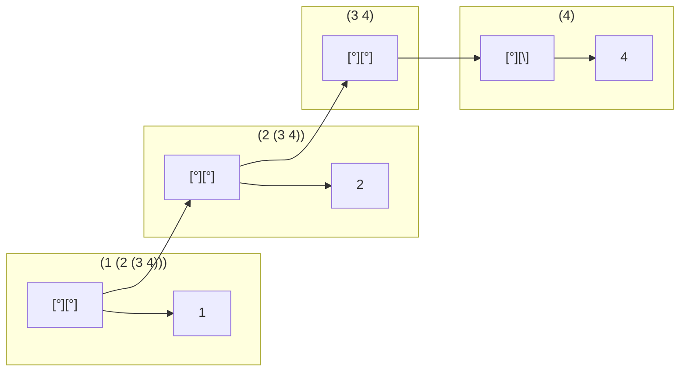

## 2.17
````scheme
; 2.17

; Define a procedure last-pair that returns the list that contains only the last element of a given (nonempty) list:

(define (list-ref items n)
  (if (= n 0)
      (car items)
      (list-ref (cdr items) (- n 1))))


(define (last-pair l)
  (list-ref l ( - (length l) 1))
  )
````

## 2.18
````scheme
; Define a procedure reverse that takes a list as argument and returns a list of the same elements in reverse order:

(define (reverse l)
    (define (rev newList n)
      (if (= (length l) n)
          newList
        (rev  (cons (list-ref l n) newList) (+ n 1)))
  )
  (rev (list) 0)
  )
````
## 2.19
````scheme
(define us-coins (list 50 25 10 5 1))
(define uk-coins (list 100 50 20 10 5 2 1 0.5))
(define reversed-coins (list 1 5 10 25 50))

; Define the procedures first-denomination, except-first-denomination, and no-more? in terms of primitive operations on list structures.


(define (no-more? coin-values)
  (= (length coin-values) 0)
  )

(define (first-denomination coin-values)
  (car coin-values)
  )

(define (except-first-denomination coin-values)
  (cdr coin-values)
  )


(define (cc amount coin-values)
  (cond ((= amount 0) 1)
        ((or (< amount 0) (no-more? coin-values)) 0)
        (else
         (+ (cc amount
                (except-first-denomination coin-values))
            (cc (- amount
                   (first-denomination coin-values))
                coin-values)))))


;(cc 100 us-coins)

; Does the order of the list coin-values affect the answer produced by cc? Why or why not?
;(cc 100 reversed-coins)

; It doesn't seem like the order actually matters in this scenario. We are always subtracting and computing every possible combination
````
## 2.20
````scheme
(define (same-parity . l)
  (define (even? x)
    (= (remainder x 2) 0))
  (define (parity newList listElement even)

      (if (= (length l) listElement)
          newList
          (if (or (and (even? (list-ref l listElement)) even)  (and (not (even? (list-ref l listElement))) (not even)))
           (parity  (cons (list-ref l listElement) newList ) (inc listElement) even)
           (parity  newList (inc listElement) even)
           )
          )
  )
  (reverse (parity (list) 0 (even? (car l)))
          )
  )

; I don't love this solution with the reverse - it can also be done with a counter - but that seems to run counter to lisp elegance 

(define (same-parity2 . l)
  (define (even? x)
    (= (remainder x 2) 0))
  (define (parity newList listRemainder even)

      (if (= (length listRemainder) 0)
          newList
          (if (or (and (even? (car listRemainder)) even)  (and (not (even? (car listRemainder))) (not even)))
           (parity  (cons (car listRemainder) newList ) (cdr listRemainder) even)
           (parity  newList (cdr listRemainder) even)
           )
          )
  )
  (reverse (parity (list) l (even? (car l)))
          )
  )


;(same-parity 1 2 3 4 5 6 7)
;(1 3 5 7)

;(same-parity 2 3 4 5 6 7)
;(2 4 6)

;(same-parity2 1 2 3 4 5 6 7)
;(1 3 5 7)

;(same-parity2 2 3 4 5 6 7)
;(2 4 6)
````
## 2.21
````scheme
;2.21

(define (scale-list items factor)
  (if (null? items)
      nil
      (cons (* (car items) factor)
            (scale-list (cdr items) factor))))

(define (map proc items)
  (if (null? items)
      nil
      (cons (proc (car items))
            (map proc (cdr items)))))


;Here are two different definitions of square-list. Complete both of them by filling in the missing expressions:

(define (square-list items)
  (if (null? items)
      nil
      (cons (* (car items) (car items)) (square-list (cdr items)))))
(define (square-list2 items)
  (map (lambda (x) (* x x)) items))

(square-list (list 1 2 3 4))
````
## 2.22
````scheme
; 2.22

; Louis Reasoner tries to rewrite the first square-list procedure of exercise 2.21 so that it evolves an iterative process:

(define (square-list3 items)
  (define (iter things answer)
    (if (null? things)
        answer
        (iter (cdr things) 
              (cons (square (car things))
                    answer))))
  (iter items nil))


; Unfortunately, defining square-list this way produces the answer list in the reverse order of the one desired. Why?
; This is reversed because when you iterate through the list it builds the list - and building a list with cons (newElement existingList) always builds the list backwards.
; In other words if you iterate through (list 1 2 3) and call (cons 1 newList) (cons 2 newList) (cons 3 newList) you get (list 3 2 1)

;Louis then tries to fix his bug by interchanging the arguments to cons:

(define (square-list4 items)
  (define (iter things answer)
    (if (null? things)
        answer
        (iter (cdr things)
              (cons answer
                    (square (car things))))))
  (iter items nil))

;This doesn't work either. Explain.
;(square-list4 (list 1 2 3 4))
; reversing the arguments to cons won't work either. In that case you get a malformed list with nulls as the first argument
````

## 2.23
````scheme
; Give an implementation of for-each.


(define (for-each proc items)
  (cond ((> (length items) 0) (proc (car items))
       (for-each proc (cdr items)))
      )
  )

;(for-each (lambda (x) (newline) (display x))
 ;         (list 57 321 88))
````
## 2.24

 Suppose we evaluate the expression (list 1 (list 2 (list 3 4))).
 Give the result printed by the interpreter

````scheme
(1 ( 2 ( 3 4)))
````

 the corresponding box-and-pointer structure,




 and the interpretation of this as a tree (as in figure 2.6).
````mermaid
graph TD
    A(("(1 (2 (3 4)))"))-->B((1))
    A-->C(("(2 ( 3 4))"))
    C-->F((2))
    C-->G(("(3 4)"))
    G-->E(("3"))
    G-->H(("4"))
````
